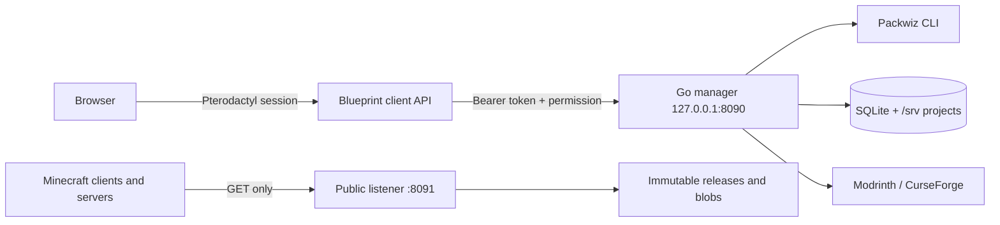

# Packwiz Manager for Pterodactyl

Packwiz Manager v0.2.0 adds a Packwiz server route through Blueprint. Loopback Go service owns canonical packs, SQLite state, provider calls, uploads, and immutable releases. Pterodactyl game volumes never own canonical source.



## Prerequisites

- Linux amd64/arm64 with systemd, curl, OpenSSL; Java 21 for current Minecraft servers.
- Pterodactyl 1.x plus current Blueprint. Stock Pterodactyl Docker is deliberately not modified.
- Public HTTPS reverse proxy for port 8091. Keep management port 8090 private.

## Install

```bash
curl -fL --proto '=https' --tlsv1.2 -o install.sh https://github.com/packwiz-manager/packwiz-manager/releases/download/v0.2.0/install.sh
curl -fL --proto '=https' --tlsv1.2 -o SHA256SUMS https://github.com/packwiz-manager/packwiz-manager/releases/download/v0.2.0/SHA256SUMS
sha256sum -c SHA256SUMS --ignore-missing
sudo bash install.sh --version v0.2.0 --pack-host https://pack.example.com/public
```

Installer verifies assets, installs unprivileged hardened service, generates 64-hex token, waits for readiness, then installs Blueprint. Existing config/token/data survive upgrade.

Service only: `sudo bash install.sh --version v0.2.0 --service-only`. Native Blueprint uses `blueprint -install packwizmanager`. Blueprint Docker:

```bash
sudo bash install.sh --version v0.2.0 --compose-file /srv/pterodactyl/docker-compose.yml --extensions-dir /srv/pterodactyl/extensions
```

Stock Docker detection leaves service installed and skips extension with status 3. Image never replaced.

## Use

Open `/server/<identifier>/packwiz`; create project; choose Minecraft/loader; search provider. Modrinth/CurseForge calls stay server-side. Configure CurseForge via `PWM_CURSEFORGE_API_KEY` in `/etc/packwiz-manager/config.env`, then restart. Key is never returned.

Existing Packwiz ZIPs can be imported with a root `pack.toml` (a single wrapper directory is also accepted). The Files tab accepts uploads or HTTP/HTTPS URL imports into the configured path allowlist. URL fetches enforce DNS/IP SSRF checks, redirect/time/size caps, and never forward service credentials. Installed Packwiz items can change client/server/both side or be removed; Settings edits pack name/version and Minecraft/loader metadata transactionally.

Custom JAR tab accepts ZIP-valid `.jar`, streams SHA-256, stores content-addressed blob, and creates Packwiz metadata. **Custom JARs execute Minecraft code. Trust source.** Choose client/server/both and `mods/` destination.

Publish runs `packwiz refresh`, stages regular files, hashes manifest, promotes immutable revision, and changes stable current pointer. Rollback selects old immutable revision. Stable URL: `https://pack.example.com/public/<slug>/pack.toml`.

## Server integration

Use pinned, SHA-256-verified bootstrap from [`BOOTSTRAP_LOCK`](BOOTSTRAP_LOCK) and abort before Minecraft on failure:

```bash
#!/usr/bin/env bash
set -Eeuo pipefail
java -jar packwiz-installer-bootstrap.jar -g -s server 'https://pack.example.com/public/my-pack/pack.toml'
exec ./run.sh
```

The Server integration tab previews, uploads, checksum-verifies, and applies this wrapper through Wings while the server is stopped. It retains the old startup command for exact revert. The action is root-admin-only and audited. Do not manage `world/`, logs, `server.properties`, ops/whitelist, or loader runtime files unless intentional.

## Reverse proxy, Cloudflare, operations

Proxy only public listener: `location /public/ { proxy_pass http://127.0.0.1:8091/public/; }`. Never proxy 8090.

Cloudflare mutation is opt-in. For a remotely managed tunnel with an existing final `http_status:404`, the installer preserves unrelated ingress and updates/creates only the requested CNAME. Use a scoped token:

```bash
sudo env CLOUDFLARE_API_TOKEN=... CF_ACCOUNT_ID=... CF_ZONE_ID=... \
  CF_TUNNEL_ID=... CF_HOSTNAME=pack.example.com \
  bash install.sh --version v0.2.0 --pack-host https://pack.example.com/public --configure-cloudflare
```

`CF_SERVICE_URL` defaults to `http://127.0.0.1:8091`. A DNS failure restores the prior tunnel configuration. The token is passed through a mode-0600 temporary curl config and is not logged.

- Backup: stop service; copy `/srv/packwiz-manager` and `/etc/packwiz-manager`; restart.
- Upgrade: rerun versioned installer.
- Uninstall: `sudo bash uninstall.sh --remove-extension`. Data stays. `--purge-data` erases only manager data.
- Logs: `journalctl -u packwiz-manager`; readiness: `curl http://127.0.0.1:8090/readyz`.

## Tests and release

```bash
make check
cd service && go test -race ./...
bash -n installer/*.sh scripts/*.sh tests/e2e/*.sh
shellcheck installer/*.sh scripts/*.sh tests/e2e/*.sh
find extension -name '*.php' -print0 | xargs -0 -n1 php -l
bash tests/e2e/run.sh # live Blueprint/PHP/MariaDB/Valkey Docker fixture
```

Assets: manager tarballs for amd64/arm64, pinned Packwiz, `packwizmanager.blueprint`, installers, `SHA256SUMS`, SPDX SBOM.

## Security and limitations

Constant-time token checks; extension-derived permissions; size/ZIP limits; symlink/path rejection; SSRF-safe resolution and redirects; no shell interpolation; GET/HEAD-only public handler. Public endpoint cannot reach drafts, DB, logs, or secrets.

v0.2 is single-node SQLite. Blueprint cannot safely extend native Pterodactyl permission enums, so extension maps permissions at proxy. Provider-key validation remains deployment-specific. CI includes deterministic Go tests plus a live Blueprint Docker extension install, route, migration, frontend, and HTTP fixture.

See [ADR](docs/decisions/0001-service-boundaries.md) and [changelog](CHANGELOG.md).
